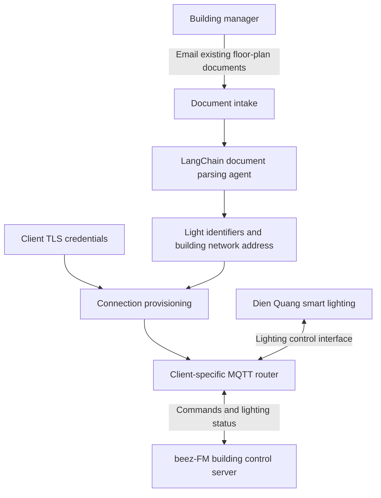
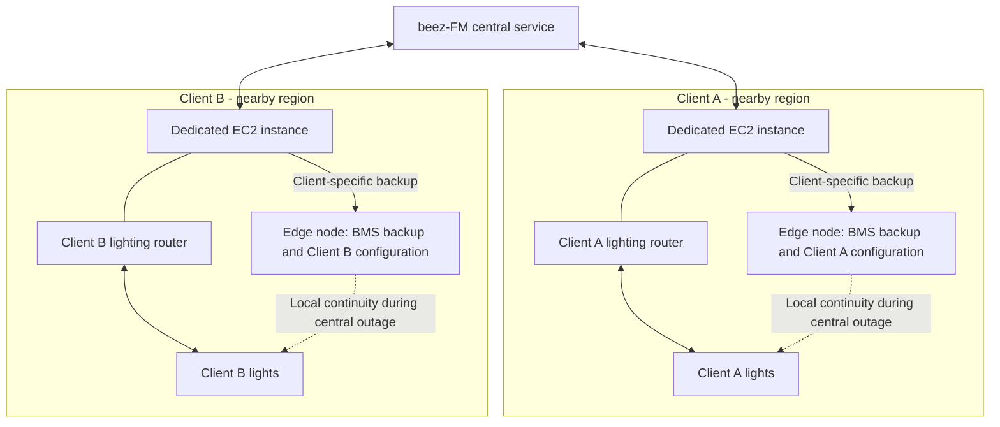

# Dien Quang × beez-FM lighting integration

**From an existing building floor plan to connected lighting, with a dedicated regional server for each client.**

Dien Quang is an established lighting provider in Vietnam. Its smart lighting supports control beyond the wall switch. I built a Message Queuing Telemetry Transport (MQTT) router that connects these lights to beez-FM's building control server through their application programming interface (API).

The goal is near-instant, safe connection once the building's information and credentials are ready, reducing manual onboarding and customer acquisition cost (CAC). This is an architectural overview of proprietary technology; implementation source, customer documents, addresses, and credentials are not published here. Timing and cost are design goals, not benchmark results reported by this repository.

## From floor plan to connected lights

Building managers already hold floor plans that identify their lighting. They can email the existing Portable Document Format (PDF) files instead of arranging an engineer's site visit. A LangChain agent (software that uses a language model to interpret documents and coordinate tools) extracts the light identifiers and the building's Internet Protocol (IP) address from the supplied onboarding material. The router uses the extracted configuration and provisioned Transport Layer Security (TLS) credentials to connect the building's lights to beez-FM.

The public diagram separates document parsing from credential provisioning. Public certificates and private keys have different handling requirements: private keys should use a protected provisioning channel, remain outside model inputs, and never appear in source control or logs. This is a security requirement for the design, not a claim that the proprietary implementation has been independently audited here.

## One regional deployment per client

Each new client gets a dedicated Amazon Elastic Compute Cloud (EC2) instance near their region. Separate instances provide fault isolation (limiting the effect of one client's failure on other clients) and keep processing close to the buildings they serve.

Edge nodes (computers close to the building's devices) also retain a backup of the building management system (BMS) and that client's configuration. The intent is to keep the client's product operating when the central service is unavailable, rather than making every lighting operation depend on a connection to headquarters.

The diagram shows the intended continuity path at a high level. It does not specify backup frequency, recovery time, or how changes are reconciled after reconnection. A dedicated instance isolates clients; the edge copy provides a separate continuity mechanism.

## Why this matters

| Design choice | Intended benefit |
| --- | --- |
| Reuse floor plans managers already have | Less onboarding work and fewer site visits |
| Agent-assisted extraction | Turn building documents into connection configuration |
| MQTT routing into beez-FM | Bring smart lighting into building-wide control |
| Dedicated regional instance per client | Limit shared failures and reduce network distance |
| Client-specific BMS backup at the edge | Preserve local operation during a central outage |

## References

- [Dien Quang smart lighting solutions](https://b2b.dienquang.com/products/giai-phap-chieu-sang-thong-minh-toan-dien-dien-quang) — vendor background. The beez-FM integration and deployment architecture above are my account.
- [GitHub: create a repository for the authenticated user](https://docs.github.com/en/rest/repos/repos#create-a-repository-for-the-authenticated-user) — publication administration reference, checked 10 September 2026; API version 2022-11-28.
